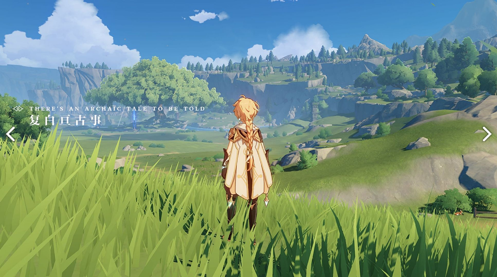
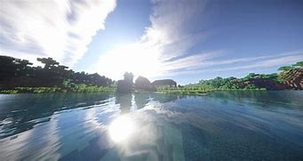
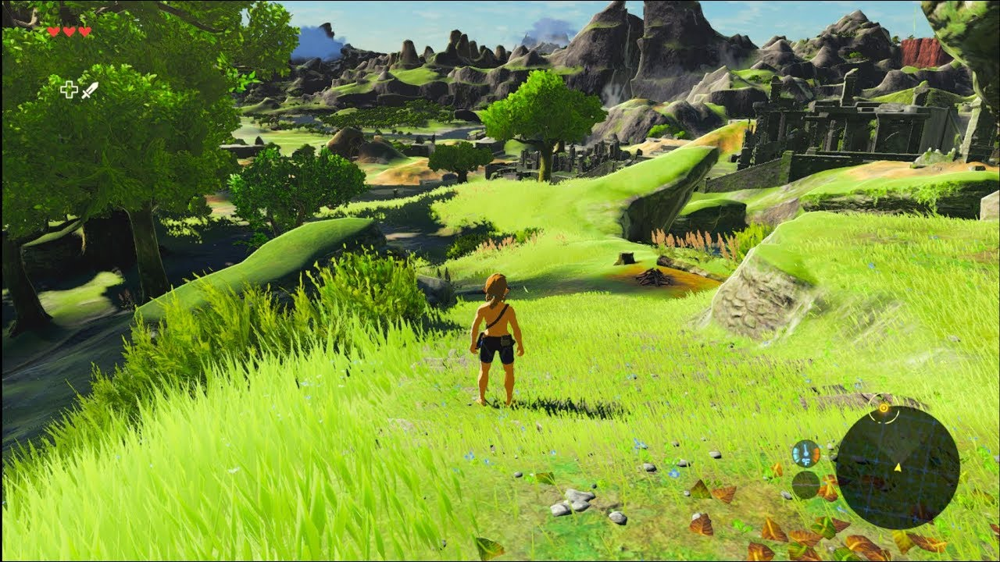
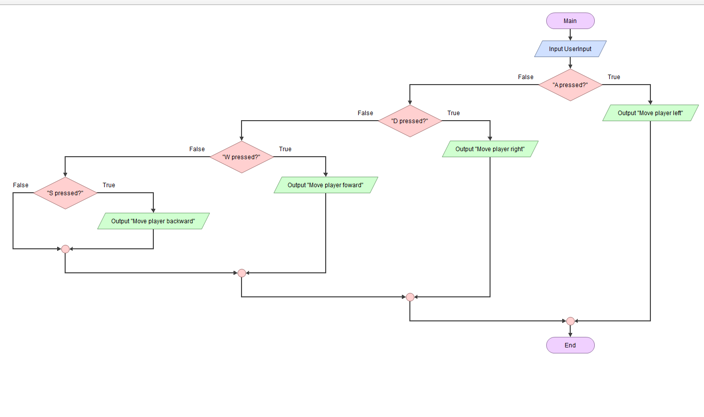
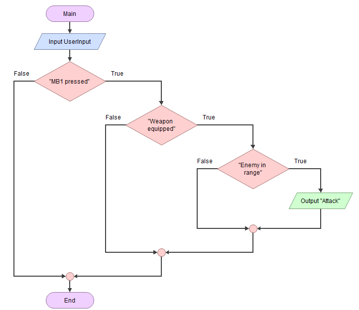

# Project Proposal

## Identifying And Defining

### Identifying a Need
__Need:__ My game aims to build up curiosity in young children through exploration and interesting questlines such as collecting items and finding characters.\
__Problem Statement:__ Young children need engaging and fun games to develop their curiosity. A fun RPG game that lets players roam and explore a world. It also includes fun and interactive quests that children are able to complete.\
__Skill Development:__ To develop the skills needed to create this game, I will follow the Unity Learn tutorial: https://learn.unity.com/project/creator-kit-rpg?uv=2021.3

### Requirements Outline
__Inputs:__ My game will need to track keyboard inputs such as WASD or arrow keys to track character movement. It also needs to track mouse movements and clicks to identify the decisions made by the player.\
__Processing:__ My program will check for interactions between the character/player and NPCs. It will also check if characters enter/exit building and modify the background accordingly.\
__Outputs:__ The game will display character, active quests and background such as building, grass or fences. It will also display character dialogue when interacting with a character. It will also display information to the user when the character reaches a specific location.\
__Transmission:__ There will be no need for data transmission as it is just a solo RPG game. It is will also be able to be played offline.\
__Storage:__ User progress will be stored and saved locally so the user can safely quit and and log off without losing any progress.\

### Functional Requirements
__User Interaction:__ The user will intereact with the system via mouse movevments, clicking, and keyboard commands. The user will be able to move the character, pick up items, select options as well as interact with NPCs. For example, WASD will move a character around and clicking on a NPC will begin an interaction with it, whether it is displaying a quest or adding to the story.\
__Core Gameplay or Simulation Mechanics:__ My game will need movement in NSEW directions. This is completed by using the WASD keys. When pressed, the character will move in the direction of the key pressed e.g pressing A will cause the player to move to the left. Combat will be available when encoutering enemies. If a weapon is equipped, clicking will cause a slash, killing the enemy if they are in range. Quests, such as object collection will also be part of the game. Text boxes will show when a user interacts with a NPC, displaying a quest and the option to accept and decline.\
__Scoring and Feedback:__ If a user tries to enter a restricted area or a area they have not unlocked, warning messages will appear, warning the user to leave the said area.\
__Level Progression or Simulation Stages:__ New levels will be available to the user when they complete the quest that allows them to access the new area, giving them new items and quests.\
__Saving and Loading Data:__ User progress will auto save at even intervals. When booting up a game, it will automatically load the latest save. User can also manually save. All saves will be done locally.\

### Non-Functional Requirements
__Performance Requirements:__ The game should load under 10 seconds and respond to user inputs instantly without any lag. FPS will depend on the components of the user's computer.\
__Usability Requirements:__ The game's UI will display play, saves and tutorial buttons. The tutorial will include a list of keybinds, and guides on how to complete quests and the games combat system, giving them knowledge on all the machanics of the game.\
__Compatibility Requirements:__ My game can only be run on PC. Mobile and web browsers will be unavailable.\
__Scalability Requirements:__ The game should be able to scale to include new levels, items and game machanics without having a drop in performance.
__Reliability and Availability:__ The system should be available 90% of the time. It does not need to handle network disruptions as it runs offline. In the case of a crash, the game will load back to its latest save, whether made by the user of automatically.

### Consideration of Social and Ethical Issues
__What is Equity and Accessibility:__ Equity recognizes that different circumstances require different resources and opportunities to achieve an equal outcome. Accessibility means the quality of being easily reached, entered, or used by people who have a disability.\
__Accessibility:__ My game will be able to be used by deaf people with the help of ingame subtitles displaying the sounds played. There will also be a different colour set for colourblind people. However, it will now cater for blind or other disabilites such as missing limbs.
__Privacy and Data Protection:__ My game will not collect personal info and user data.
__Fairness and Representation:__ My game will avoid any stereotypes and bias. It will not display harmful stereotypes and project a diverse range of characters and scenarios.
__Mental and Emotional Well-Being:__ My game will not affect users mental health. It will not promote excessive violence and will encourage a positive experience.
__Cultural Sensitivities:__ There will not be any content offensive the any cultures. It will not display any inappropriate themes and symbols that might be offensive and harmful to cultures of any kind.

## Researching and Planning
### Exploration of Existing Ideas
|Game|P|M|I|
|--|--|--|--|
|Genshin Impact|Genshin impact allows user freedom. It allows the players to explore and travel the world, choosing their development path their own way.|However, Genshin Impact is a pay to win game, making users have to spend money if they want to progress the game in a timely manner.|I want to impliment its open world factor. I want the user to be able to explore the world their own way.|
Minecraft|Minecraft is a creative and fun open world game that promotes exploration and allows the user to choose their own path, whether it is to kill the boss or build a house.|Minecraft gets really boring after a while as playing and grinding the game becomes too tiring and time consuming|I want to create a game similer to minecraft where it entices exploration.|
Zelda Breath Of the Wild|Breath of the wild is one of the most player creative oriented game ever created with a wide variety of weapons and fighting styles as well as a large freedom of progression. It allows the player to progress and complete the game in any way and order they want.| There is also a downside to this. It means that the game requires a lot of hours to complete making most users loose interest have way through.| I what to be able to create a game where it focuses on player creativivty, allowing the player to progress throught the game any way they wanted.

### Flowchart & Pseudocode 

__Movement__

\
\
BEGIN Movement\
&nbsp; &nbsp; &nbsp;INPUT UserInput\
&nbsp; &nbsp; &nbsp;IF 'A' pressed THEN\
&nbsp; &nbsp; &nbsp; &nbsp; &nbsp; &nbsp;Move player right\
&nbsp; &nbsp; &nbsp;ELSE IF 'D' pressed THEN\
&nbsp; &nbsp; &nbsp; &nbsp; &nbsp; &nbsp;Move player left\
&nbsp; &nbsp; &nbsp;ELSE IF 'W' pressed THEN\
&nbsp; &nbsp; &nbsp; &nbsp; &nbsp; &nbsp;Move player foward\
&nbsp; &nbsp; &nbsp;ELSE If 'S' pressed THEN\
&nbsp; &nbsp; &nbsp; &nbsp; &nbsp; &nbsp;Move player backward\
&nbsp; &nbsp; &nbsp;END IF\
END Movement\
\
\
\
__Combat__

\
\
BEGIN Combat\
&nbsp; &nbsp; &nbsp;INPUT UserInput\
&nbsp; &nbsp; &nbsp;If 'MB1' pressed THEN\
&nbsp; &nbsp; &nbsp; &nbsp; &nbsp; &nbsp;If Weapon equipped THEN\
&nbsp; &nbsp; &nbsp; &nbsp; &nbsp; &nbsp; &nbsp; &nbsp; &nbsp;If Enemy in range THEN\
&nbsp; &nbsp; &nbsp; &nbsp; &nbsp; &nbsp; &nbsp; &nbsp; &nbsp; &nbsp; &nbsp; &nbsp;Attack\
&nbsp; &nbsp; &nbsp;ELSE Do nothing
END Combat